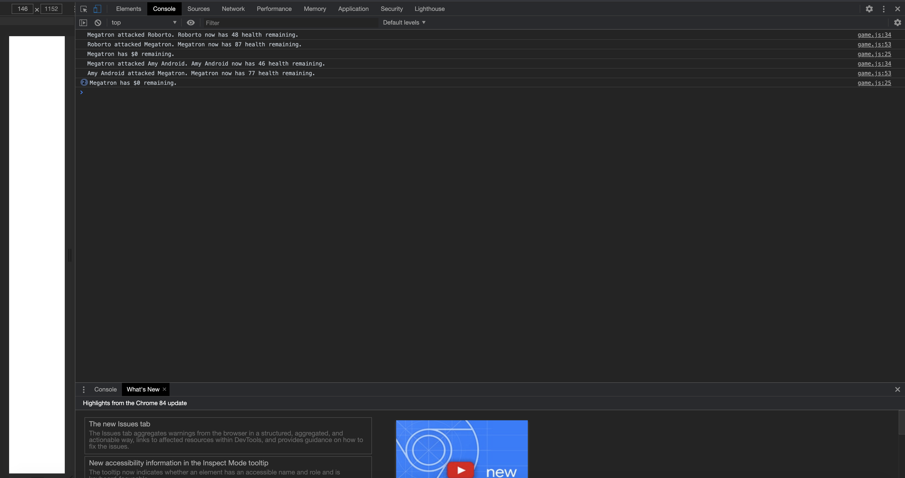

# Robot Gladiators

## Description 
This project is a hackathon like style game using JavaScript core concepts like functions, loops, and conditional statements. This game is ran in Chrome Dev Tools browser console. 

## Table of Contents
* [Installation](#installation)
* [Usage](#usage)
* [License](#license)
* [Contributing](#contributing)
* [Tests](#tests)
* [Questions](#questions)

## Installation 
The user should clone the repo and open the index file into their browser. Then the user should open up Chrome Dev Tools to see the attacks and health of the players in the game in the console. 

## Usage 
This application will allow users choose a fighter and play against the computer in a series of battles. The user would be able to use potions to gain back their health.  
Please view deployed application on [Heroku](https://nicolewallace09.github.io/robot-gladiators/scree) 

## License 
This project is license under MIT

## Contributing 
Contributors should read the installation section. 

## Tests
There are no tests for this application. 

## Questions
If you have any questions about this projects, please contact me directly at nicole.elisaw@gmail.com. You can view more of my projects at https://github.com/nicolewallace09.